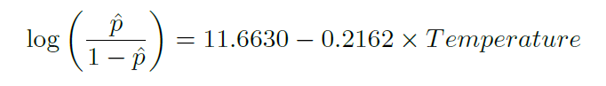

##Graded Questions

Q:1 (8.2) Baby weights, Part II. Exercise 8.1 introduces a data set on birth weight of babies. Another variable we consider is parity, which is 0 if the child is the first born, and 1 otherwise. The summary table below shows the results of a linear regression model for predicting the average birth weight of babies, measured in ounces, from parity.


(a) Write the equation of the regression line.

(b) Interpret the slope in this context, and calculate the predicted birth weight of first borns and others.

(c) Is there a statistically significant relationship between the average birth weight and parity?

**_A: (a) Regression line $\hat{y} = \beta_0 + \beta_1{x}$_**

**_Intercept $\beta_0 = 120.07$, Slope $\beta_1 = -1.93$_**

**_Substituting values, $\hat{y} = 120.07 -1.93x$_**

**_(b) Using above data, `parity` can be identified as a categorical value. It represents a value of `0` for first born and `1` for all others. Weight of first borns is 1.93 ounces higher than others._**

**_When child is first born parity $x = 0, \hat{y}_{first\ born\ weight} = \beta_0 + \beta_1{x}$_**

**_$\hat{y}_{first\ born\ weight} = 120.07 -1.93 * 0$_**

**_Predicted birth weight of first borns is 120.07 ounces_**

**_When child is not first born parity $x = 1, \hat{y}_{non\ first\ born\ weight} = \beta_0 + \beta_1{x}$_**

**_$\hat{y}_{non\ first\ born\ weight} = 120.07 -1.93 * 1 = `r 120.07 -1.93`$_**

**_Predicted birth weight of non-first borns is `r 120.07 -1.93` ounces_**

**_(c) Null hypothesis: There is no difference in birth weights $H_0: = \beta_0 = 0$. Alternative hypothesis: There is difference in weights $H_A: \beta_0 \ne 0$_**

**_From the table $t-value = -1.62$ and the $p-value = 0.1052$._**

**_Since the p-value is greater than $\alpha = 0.05$, we accept the $H_0$. There is no difference in birth weights first born or not. Solving regression equation results otherwise. Due to the differences in results, it can be concluded that regression equation is statistically significant predictor and not a practically significant predictor._**

Q:2 (8.4) Absenteeism, Part I. Researchers interested in the relationship between absenteeism from school and certain demographic characteristics of children collected data from 146 randomly sampled students in rural New South Wales, Australia, in a particular school year. Below are three observations from this data set.


\
The summary table below shows the results of a linear regression model for predicting the average number of days absent based on ethnic background (eth: 0 - aboriginal, 1 - not aboriginal), sex (sex: 0 - female, 1 - male), and learner status (lrn: 0 - average learner, 1 - slow learner).


(a) Write the equation of the regression line.

(b) Interpret each one of the slopes in this context.

(c) Calculate the residual for the first observation in the data set: a student who is aboriginal, male, a slow learner, and missed 2 days of school.

(d) The variance of the residuals is 240.57, and the variance of the number of absent days for all students in the data set is 264.17. Calculate the $R^2$ and the adjusted $R^2$. Note that there are 146 observations in the data set.


**_A: (a) Regression line $\hat{y} = \beta_0 + \beta_1{x_1} + \beta_2{x_2} + \beta_3{x_3}$_**

**_Intercept $\beta_0 = 18.93$, Slopes $\beta_1 = -9.11, \beta_1 = 3.10, \beta_1 = 2.15$_**

**_Intercept $x_1 = eth,\ x_2 = sex,\ x_3 = lrn$_**

**_Substituting values, $\hat{y} = 18.93 -9.11eth + 3.10sex + 2.15lrn$_**

**_(b) The `slope` values are interpreted as a measure of change in units of `y` for a unit increase or decrease in a particular `X` predictor variable, given that the other variables are held `constant`._**

**_Interpretation using slope of `ethnic background` variable, predicted absenteeism is 9.11 days higher among children belonging to aboriginal descent compared to non-aboriginal descent, when child gender and learning status are held constant._**

**_Using slope of `gender(sex)` variable, predicted absenteeism is 3.10 days higher among male children when ethnic background and learning status of child are held constant._**

**_Using slope of `learner status` variable, predicted absenteeism is 2.15 days higher among children classified as slow learner when ethnic background and gender of child are held constant._**

**_(c) Residual for the first observation in the data set with predictor variables, eth = 0, sex = 1, lrn = 1 and observed absenteeism $y_observed = 2$ days_**

**_$\hat{y}_{predicted} = 18.93 -9.11eth + 3.10sex + 2.15lrn$_**

**_$\hat{y}_{predicted} = 18.93 -9.11 * 0 + 3.10 * 1 + 2.15 * 1$_**

**_$\hat{y}_{predicted} = `r 18.93 - (9.11 * 0) + (3.10 * 1) + (2.15 * 1)`$_**

**_Residual $e_i = y_i - \hat{y} = 2 - `r 18.93 - (9.11 * 0) + (3.10 * 1) + (2.15 * 1)` = `r 2 - (18.93 - (9.11 * 0) + (3.10 * 1) + (2.15 * 1))`$_**

**_(d) Variance of the residuals $Var(e_i) = 240.57$, Variance of the number of absent days for all students(outcomes) $Var(y_i) = 264.17$_**

**_To determine the amount of variability in the response that was explained by the model $R^2 = 1 - \frac{Var(e_i)} {Var(y_i)}$_**

**_$R^2 = 1 - \frac{240.57} {264.17} = `r round(1 - (240.57/264.17), 4)`$_**

**_Total number of observations $n = 146$, number of preditor variables $k = 3$, Adjusted ${R^2}_{adj} = 1 - {\frac{Var(e_i)} {Var(y_i)}} * {\frac{n -1} {n-k-1}}$_**

**_Adjusted ${R^2}_{adj} = 1 - {\frac{240.57} {264.17}} * {\frac{146 -1} {146-3-1}} = `r round(1 - ((240.57/264.17) * ((146 -1)/(146-3-1))), 4)`$_**

Q:3 (8.8) Absenteeism, Part II. Exercise 8.4 considers a model that predicts the number of days absent using three predictors: ethnic background (eth), gender (sex), and learner status (lrn). The table below shows the adjusted R-squared for the model as well as adjusted R-squared values for all models we evaluate in the first step of the backwards elimination process.


Which, if any, variable should be removed from the model first?

**_A: Adjusted $R^2$ describes the strength of a model fit, and it is a useful tool for evaluating which predictors improve the accuracy in predicting future outcomes. Greater the value of Adjusted $R^2$, better the strength of a model fit. Above table shows model without `learner status` predictor variable has greater Adjusted $R^2$. Hence, `learner status` predictor variable should be removed to improve the accuracy in predicting future outcomes._**

Q:4 (8.16) Challenger disaster, Part I. On January 28, 1986, a routine launch was anticipated for the Challenger space shuttle. Seventy-three seconds into the fight, disaster happened: the shuttle broke apart, killing all seven crew members on board. An investigation into the cause of the disaster focused on a critical seal called an O-ring, and it is believed that damage to these O-rings during a shuttle launch may be related to the ambient temperature during the launch. The table below summarizes observational data on O-rings for 23 shuttle missions, where the mission order is based on the temperature at the time of the launch. Temp gives the temperature in Fahrenheit, Damaged represents the number of damaged O-rings, and Undamaged represents the number of O-rings that were not damaged.


(a) Each column of the table above represents a different shuttle mission. Examine these data and describe what you observe with respect to the relationship between temperatures and damaged O-rings.

(b) Failures have been coded as 1 for a damaged O-ring and 0 for an undamaged O-ring, and a logistic regression model was fit to these data. A summary of this model is given below. Describe the key components of this summary table in words.


(c) Write out the logistic model using the point estimates of the model parameters.

(d) Based on the model, do you think concerns regarding O-rings are justified? Explain.


**_A: (a) Looking at the data, higher percentage of O-rings damage is noticed when temperatures are below $66^\circ F$._**

```{r, echo=F}
library(knitr)
oring.data <- data.frame(NA,NA,NA, stringsAsFactors = F)
oring.data <- rbind(oring.data, c("Below $66^\\circ F$", 8, round((8/11)*100,2)), stringsAsFactors = F)
oring.data <- rbind(oring.data, c("$66^\\circ F$ and Above", 3, round((3/11)*100,2)), stringsAsFactors = F)
oring.data<-na.omit(oring.data)
rownames(oring.data) <- NULL
kable(oring.data, digits = 2, col.names = c("Temperature", "Damages", "Percentage(%)"), format='pandoc', caption = "O-ring damages based on temperature")
```

**_(b) Logistic regression is a generalized linear model where the outcome is a two-level categorical variable. Outcome $Y_i$, (1 - damaged, 0 - undamaged) is dependent on probability $p_i$. Higher $p_i$ values leads to $Y_i = 1$ and higher $1-p_i$ value leads to $Y_i = 0$. Logistic regression models use two-stage modeling approach, first we model probability $p_i$ in relation to the predictor variables and then response variable is modeled based on probability $p_i$._**

**_Equation for logistic regression model: \[ln(\frac{\pi(Y)}{1-\pi(Y)}) = \beta_0 + \beta_1X\]_**

**_Where $\pi(Y)$ is probability of Y and \[ln(\frac{\pi(Y)}{1-\pi(Y)})\] is known as $logit(\pi)$._**

**_As, we are interested in evaluating probability of Y, $\pi(Y)$, equation from above can be written as, _**

**_\[\pi(Y) = \frac{exp(\beta_0 + \beta_1X)}{1 + exp(\beta_0 + \beta_1X)}\]_**

**_$exp(\beta_0 + \beta_1X)$, is known as `log odds`_**

**_Key components of the summary table, $\beta_0 = 11.6630, \beta_1 = -0.2162$_**

**_Since $\beta_1$ is negative, for every one-degree increase in temperature, `log odds` decreases by 0.2162. This translates to decrease in O-rings damage probability. On the other hand, for every one -degree in drop in temperature, `log odds` increase by 0.2162, translates to increase in O-rings damage probability._**

**_(c) Equation for logistic regression model: \[ln(\frac{\pi(Y)}{1-\pi(Y)}) = \beta_0 + \beta_1X\]_**

**_Model parameters from summary table, $\beta_0 = 11.6630, \beta_1 = -0.2162$_**

**_\[ln(\frac{\pi(Y)}{1-\pi(Y)}) = 11.6630 -0.2162X\]_**

**_Point estimate \[\pi(Y) = \frac{exp(\beta_0 + \beta_1X)}{1 + exp(\beta_0 + \beta_1X)}\]_**

**_\[\pi(Y) = \frac{exp(11.6630 -0.2162X)}{1 + exp(11.6630 -0.2162X)}\]_**

**_(d) While there is a real association at lower temperatures O-ring gets damaged, we cannot interpret a causal connection between the variables because these data are observational. Lowest temperature shown in the data is $53^{\circ} F$ and highest is $81^{\circ} F$. Applying a model estimate to values outside of the realm of the original data is called extrapolation. If we extrapolate, we are making an unreliable bet that the approximate logistic relationship will be valid in places where it has not been analyzed. Also, point estimates cannot be validated if temperature measurement scales are changed from Fahrenheit to other scales example Celsius or Kelvin._**


Q:5 (8.18) Challenger disaster, Part II. Exercise 8.16 introduced us to O-rings that were identified as a plausible explanation for the breakup of the Challenger space shuttle 73 seconds into takeoff in 1986. The investigation found that the ambient temperature at the time of the shuttle launch was closely related to the damage of O-rings, which are a critical component of the shuttle. See this earlier exercise if you would like to browse the original data.


(a) The data provided in the previous exercise are shown in the plot. The logistic model fit to these data may be written as



Where $\hat{p}$ is the model-estimated probability that an O-ring will become damaged. Use the model to calculate the probability that an O-ring will become damaged at each of the following ambient temperatures: 51, 53, and 55 degrees Fahrenheit. The model-estimated probabilities for several additional ambient temperatures are provided below, where subscripts indicate the temperature:


(b) Add the model-estimated probabilities from part (a) on the plot, then connect these dots using a smooth curve to represent the model-estimated probabilities.

(c) Describe any concerns you may have regarding applying logistic regression in this application, and note any assumptions that are required to accept the model's validity.

**_A: (a) Equation for logistic regression model: \[log(\frac{\hat{p}}{1-\hat{p}}) = \beta_0 + \beta_1X\]_**

**_Equation can be rewritten as, _**

**_\[\frac{\hat{p}}{1-\hat{p}} = e^{\beta_0 + \beta_1X}\]_**

**_Solving the equation, _**

**_\[\hat{p} = (1-\hat{p}) * e^{\beta_0 + \beta_1X}\]_**

**_\[\hat{p} = e^{\beta_0 + \beta_1X} - \hat{p} * e^{\beta_0 + \beta_1X}\]_**

**_\[\hat{p} + \hat{p} * e^{\beta_0 + \beta_1X} = e^{\beta_0 + \beta_1X} \]_**

**_\[\hat{p} * (1 + e^{\beta_0 + \beta_1X}) = e^{\beta_0 + \beta_1X} \]_**

**_\[\hat{p} = \frac{e^{\beta_0 + \beta_1X}} {(1 + e^{\beta_0 + \beta_1X})} \]_**

**_Substituting values, $\beta_0 = 11.6630, \beta_1 = -0.2162$ and temperatures 51, 53, and 55 degrees Fahrenheit. _**

```{r, echo=T}
library(knitr)
oring.data <- data.frame(NA,NA,NA)
p = exp(11.6630 -(0.2162 * 51))/(1 + exp(11.6630 -(0.2162 * 51)))
r <- c(51, "$\\hat{p}_{51} = \\frac{e^{11.6630 -(0.2162 * 51)}} {1 + e^{11.6630 -(0.2162 * 51)}}$", round(p,3))
oring.data <- rbind(oring.data, r, stringsAsFactors = F)

p = exp(11.6630 -(0.2162 * 53))/(1 + exp(11.6630 -(0.2162 * 53)))
r <- c(53, "$\\hat{p}_{53} = \\frac{e^{11.6630 -(0.2162 * 53)}} {1 + e^{11.6630 -(0.2162 * 53)}}$", round(p,3))
oring.data <- rbind(oring.data, r, stringsAsFactors = F)

p = exp(11.6630 -(0.2162 * 55))/(1 + exp(11.6630 -(0.2162 * 55)))
r <- c(55, "$\\hat{p}_{55} = \\frac{e^{11.6630 -(0.2162 * 55)}} {1 + e^{11.6630 -(0.2162 * 55)}}$", round(p,3))
oring.data <- rbind(oring.data, r, stringsAsFactors = F)

oring.data<-na.omit(oring.data)
rownames(oring.data) <- NULL
names(oring.data)<-c("Temperature", "Equation", "Probability")

kable(oring.data, digits = 3, col.names = c("Temperature", "Equation", "Probability($\\hat{p}_t$)"), format='pandoc', caption = "O-ring damage Probability based on Temperature")

```

**_(b) Graphical representation_**

```{r, echo=T}
library(ggplot2)
ggplot(oring.data,aes(x=Temperature,y=Probability, group=1))+geom_line()+geom_point() + labs(x="Temperature", y="Probability", title = "O-ring damage Model-Estimated Probabilities based on Temperature")
```

**_(c) From the observational study, the probabilities graph clearly suggest O-ring will be damaged at lower temperatures. Study suggests, O-ring is critical part that can cause space shuttle to explode at low temperatures. Shuttle launch decision should be erred on the side of caution if temperatures are lower than $56^\circ F$._**
